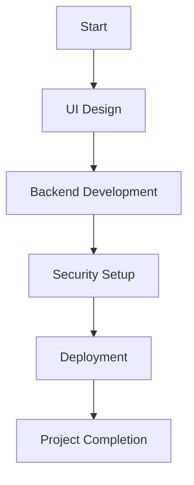

### **Project Activities Sequencing in PMP**

**Project Activities Sequencing** is the process of **arranging tasks in logical order** based on dependencies, constraints, and project requirements. It ensures that activities are executed **efficiently and without bottlenecks**.

---

### **Why Is Activity Sequencing Important?**

✅ **Ensures Logical Flow** – Prevents disorderly execution of tasks.  
✅ **Optimizes Resource Allocation** – Reduces idle time and dependency conflicts.  
✅ **Improves Scheduling Accuracy** – Helps estimate realistic timelines.  
✅ **Enhances Risk Management** – Identifies critical dependencies that might cause delays.

---

### **Knowledge Area in PMBOK Guide**

Activity sequencing belongs to **Project Schedule Management**, and it interacts with:  
🔹 **Scope Management** – Ensuring activities align with work breakdown structure (WBS).  
🔹 **Risk Management** – Identifying risks related to dependencies and delays.  
🔹 **Integration Management** – Synchronizing workflows across project phases.

---

### **Steps in Activity Sequencing**

1️⃣ **Define Activities** – List tasks required for completion.  
2️⃣ **Identify Dependencies** – Determine relationships between activities (Predecessor-Successor).  
3️⃣ **Sequence Activities** – Arrange them using logical relationships.  
4️⃣ **Determine Lead & Lag Times** – Define task overlaps or waiting periods.  
5️⃣ **Create a Network Diagram** – Visualize dependencies using flow charts or Gantt charts.  
6️⃣ **Validate & Optimize Sequence** – Ensure alignment with project scope and constraints.

📌 **Example: Activity Sequencing for Web Application Deployment**

🔹 **Task 1:** Design UI Components (**No dependencies**)  
🔹 **Task 2:** Develop API **(Depends on UI completion)**  
🔹 **Task 3:** Implement Security **(Depends on API being ready)**  
🔹 **Task 4:** Deploy Infrastructure **(Depends on security being configured)**

---

### **Dependency Types in Activity Sequencing**

| **Dependency Type**       | **Definition**                            | **Example**                                                      |
| ------------------------- | ----------------------------------------- | ---------------------------------------------------------------- |
| **Finish-to-Start (FS)**  | A task must finish before the next starts | API setup must finish before security implementation             |
| **Start-to-Start (SS)**   | Two tasks begin at the same time          | UI design and API documentation start together                   |
| **Finish-to-Finish (FF)** | Two tasks must finish at the same time    | Database indexing and backend development must complete together |
| **Start-to-Finish (SF)**  | A task begins before another finishes     | Monitoring setup starts before deployment finishes               |

---

### **Likely PMP Certification Exam Question**

📌 **Which technique is used to arrange project tasks in logical order based on dependencies?**  
A) Integrated Change Control  
B) Work Breakdown Structure (WBS)  
C) Project Activities Sequencing  
D) Cost Estimation Analysis

💡 **Correct Answer:** **C) Project Activities Sequencing**

Since you're refining **workflow optimization and scheduling strategies**, mastering **activity sequencing** will enhance execution efficiency and prevent timeline bottlenecks.

### **Precedence Diagramming Method (PDM) in Project Management**

**Precedence Diagramming Method (PDM)** is a **visual scheduling technique** that shows **logical relationships between project activities** using dependency links. It helps project managers **sequence tasks efficiently, identify dependencies, and optimize project scheduling**.

---

### **Why Is Precedence Diagramming Important?**

✅ **Defines Task Dependencies** – Ensures activities follow logical order.  
✅ **Supports Critical Path Analysis** – Identifies tasks that directly impact project duration.  
✅ **Improves Workflow Efficiency** – Helps prevent bottlenecks and sequencing conflicts.  
✅ **Enhances Schedule Visualization** – Uses **network diagrams** for clear planning.

📌 **Example:** If your project includes:  
🔹 Task A: **Design UI Components**  
🔹 Task B: **Develop Backend API** (Depends on Task A)  
🔹 Task C: **Implement Security** (Depends on Task B)

In a **Precedence Diagram**, these dependencies are visually connected to guide execution.

---

### **Four Types of Dependencies in PDM**

**Note** Finish to start is commonly asked in the PMP exam

| **Dependency Type**       | **Definition**                             | **Example**                                                  |
| ------------------------- | ------------------------------------------ | ------------------------------------------------------------ |
| **Finish-to-Start (FS)**  | Task B cannot start until Task A finishes  | API development cannot start before UI design is completed   |
| **Start-to-Start (SS)**   | Task B starts at the same time as Task A   | UI testing starts alongside API setup                        |
| **Finish-to-Finish (FF)** | Task B finishes at the same time as Task A | Backend API coding and database indexing both end together   |
| **Start-to-Finish (SF)**  | Task B must start before Task A finishes   | Server monitoring begins before full deployment is completed |

---

### **Steps to Create a Precedence Diagram**

1️⃣ **List all project activities** – Identify tasks required to complete project deliverables.  
2️⃣ **Determine dependencies** – Define logical relationships between tasks.  
3️⃣ **Draw a Network Diagram** – Connect activities using dependency links.  
4️⃣ **Estimate durations** – Assign time estimates for each task.  
5️⃣ **Identify the Critical Path** – Determine the longest sequence of dependent activities.  
6️⃣ **Optimize scheduling** – Adjust dependencies to improve efficiency.

📌 **Example: Precedence Diagram for Web Application Deployment**

```plaintext
(Start) → UI Design → Backend Development → Security Configuration → Deployment → (End)
```

✅ Tasks follow **Finish-to-Start** logic, ensuring sequential execution.

---

### **Likely PMP Certification Exam Question**

📌 **Which dependency type in Precedence Diagramming requires a successor activity to start before a predecessor finishes?**  
A) Finish-to-Start (FS)  
B) Start-to-Start (SS)  
C) Finish-to-Finish (FF)  
D) Start-to-Finish (SF)

💡 **Correct Answer:** **D) Start-to-Finish (SF)**

### **Network Diagram in Project Management**

A **Network Diagram** is a **visual representation** of project activities, dependencies, and the sequencing of tasks. It helps project managers **map workflows, identify critical paths, and optimize scheduling** for efficiency.

---

### **Why Is a Network Diagram Important?**

✅ **Clarifies Task Dependencies** – Shows how tasks connect logically.  
✅ **Supports Scheduling Optimization** – Helps improve workflow sequencing.  
✅ **Identifies the Critical Path** – Pinpoints tasks that directly affect the project's duration.  
✅ **Enhances Risk Management** – Allows early detection of scheduling bottlenecks.

---

### **Types of Network Diagrams**

| **Type**                                | **Description**                                        | **Example Usage**                |
| --------------------------------------- | ------------------------------------------------------ | -------------------------------- |
| **Precedence Diagramming Method (PDM)** | Uses nodes for activities & arrows for dependencies    | Software development projects    |
| **Arrow Diagramming Method (ADM)**      | Uses arrows to represent activities & nodes for events | Large-scale engineering projects |

📌 **Example: Precedence Diagram (PDM) for Web Application Deployment**

```plaintext
(Start) → UI Design → Backend API → Security Setup → Deployment → (End)
```

✅ **Each step flows logically**, ensuring sequential execution.

📌 **Example: Arrow Diagramming (ADM)**

```plaintext
A → B → C → D
```

✅ **Arrows represent tasks, nodes define key events.**

---

### **Critical Path Method (CPM) in Network Diagrams**

🔹 The **Critical Path** is the **longest chain of dependent tasks** that determines the project's duration.  
🔹 Delays in **critical path activities** will **extend** the total project timeline.

📌 **Example: Identifying the Critical Path**

- **Task A** (3 days) → **Task B** (5 days) → **Task C** (7 days) → **Task D** (2 days)  
  ✅ The critical path **(A → B → C → D)** determines total project duration **(17 days)**.

---

### **Likely PMP Certification Exam Question**

📌 **What is the primary purpose of a Network Diagram in project scheduling?**  
A) To define budget constraints for work packages  
B) To visualize task dependencies and sequencing  
C) To document stakeholder expectations  
D) To allocate project funding

💡 **Correct Answer:** **B) To visualize task dependencies and sequencing**

Since you're refining **process documentation and scheduling frameworks**, using **Network Diagrams** will improve timeline accuracy and workflow tracking.

### **Step-by-Step Guide to Creating Network Diagrams**

To visualize task dependencies and sequencing effectively, you can use tools like **Mermaid.js, Microsoft Project, Lucidchart, or Draw.io**. Here's a step-by-step guide:

---

### **1. Define Your Project Activities**

📌 **List all major tasks in your Work Breakdown Structure (WBS).**  
Example:  
✅ **Design UI Components**  
✅ **Develop Backend API**  
✅ **Configure Security Features**  
✅ **Deploy Infrastructure**

---

### **2. Identify Dependencies**

🔹 **Finish-to-Start (FS):** A task must finish before another begins.  
🔹 **Start-to-Start (SS):** Two tasks start simultaneously.  
🔹 **Finish-to-Finish (FF):** Two tasks must finish at the same time.  
🔹 **Start-to-Finish (SF):** A task starts before another finishes.

📌 **Example:** "Backend API development cannot start until UI components are designed."

---

### **3. Choose a Network Diagramming Tool**

✅ **Mermaid.js** – Ideal for code-based diagrams.  
✅ **Microsoft Project** – Best for professional project scheduling.  
✅ **Lucidchart / Draw.io** – Drag-and-drop diagram creation.

---

### **4. Create a Network Diagram Using Mermaid.js**

Example Mermaid.js code:



💡 This visual **maps task dependencies in sequential order**.

---

### **5. Validate and Optimize Your Diagram**

✅ Ensure correct dependencies  
✅ Check critical paths  
✅ Adjust sequencing for efficiency

---
